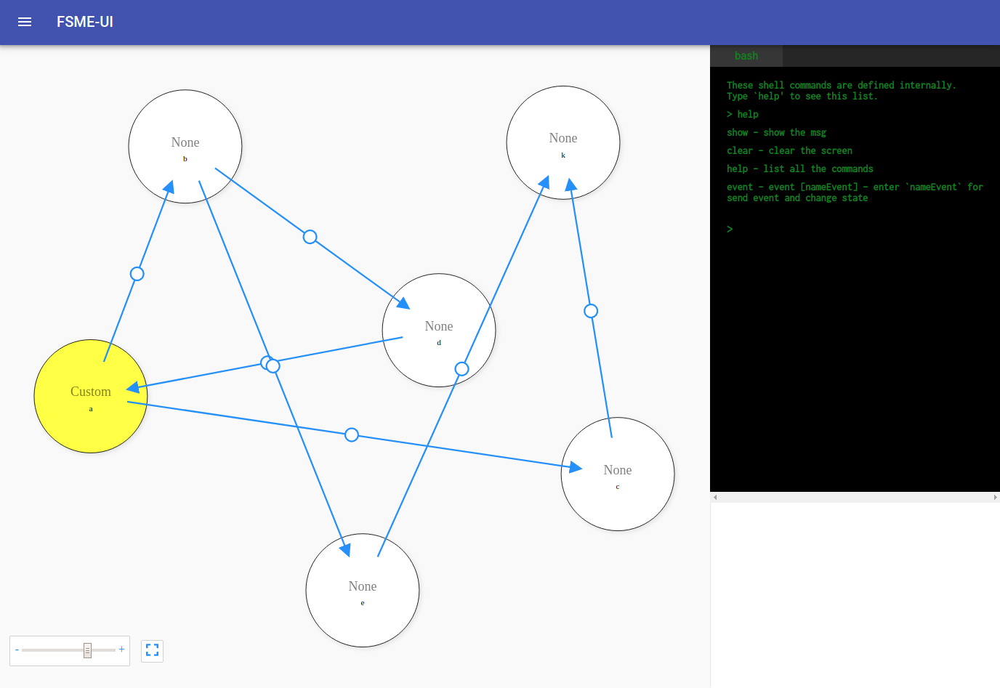

# fsme

Finite State Machine Engine for Go

[](https://godoc.org/github.com/batazor/fsme/fsm)


### Install

`go get github.com/batazor/fsme/fsm`

### Basic Example

From [examples/simple.go](./examples/simple.go)

```go
package main

import (
	"fmt"
	"github.com/batazor/fsme/fsm"
)

func main() {
	// Create new FSM
    machine, err := fsm.New()

    // Add rule
    machine.AddStateTransitionRules("a", "b", "c")
    machine.AddStateTransitionRules("b", "d", "e")
    machine.AddStateTransitionRules("c", "k")
    machine.AddStateTransitionRules("d", "a")
    machine.AddStateTransitionRules("e", "k")
    machine.AddStateTransitionRules("k")

    // Add Events
    machine.AddEvent("start", "a")
    machine.AddEvent("to b", "b")
    machine.AddEvent("to d", "d")

    // Add callback for state
    machine.AddCallback("a", "enter", func(f *fsm.FSM) { fmt.Println("Enter state: ", f.GetCurrentState()) })
    machine.AddCallback("a", "leave", func(f *fsm.FSM) { fmt.Println("Leave state: ", f.GetCurrentState()) })
    machine.AddCallback("b", "enter", func(f *fsm.FSM) { fmt.Println("Enter state: ", f.GetCurrentState()) })

    // Init State
    err = machine.SetStateTransition("a")
    if err != nil {
        fmt.Println(err)
    }

    // Send Event
    err = machine.SendEvent("to b")
    if err != nil {
        fmt.Println(err)
    }
    err = machine.SendEvent("to d")
    if err != nil {
        fmt.Println(err)
    }

    fmt.Printf("State: %s\n", machine.GetCurrentState())
}
```

### Feature

+ FSM
+ Callback [Entry, Leave]
+ UI Editor/View
+ Export
+ [Examples](./examples)

### Extends

1. Start with https://github.com/looplab/fsm
2. Start with https://github.com/theckman/go-fsm

## UI



#### Server

```bash
# Run swagger-ui
docker run -p 80:8080 \
    -e BASE_URL=/swagger \
    -e SWAGGER_JSON=/docs/swagger.json \
    -v $pwd/docs/swagger:/docs \
    swaggerapi/swagger-ui
    
# Run swagger-editor
docker run -p 80:8080 \
    -e BASE_URL=/swagger \
    -e SWAGGER_JSON=/docs/swagger.json \
    -v $pwd/docs/swagger:/docs \
    swaggerapi/swagger-editor

# Run goswagger
swagger generate server -A todo-list -f ./docs/swagger/swagger.yaml
```